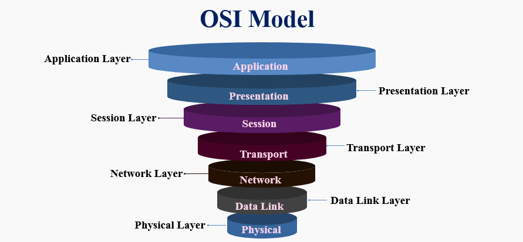

# 0x07. Networking basics #0

## Overview

This repository aims to provide a comprehensive understanding of networking fundamentals. It covers essential topics such as the OSI model, types of networks, MAC and IP addresses, and TCP/UDP protocols.

## OSI Model

### What is the OSI model?

The OSI (Open Systems Interconnection) model is a conceptual framework used to standardize the functions of a telecommunication or computing system into seven distinct layers:

1. **Physical Layer**: Responsible for the transmission and reception of unstructured raw data bits over a physical medium, such as cables or wireless signals.
2. **Data Link Layer**: Ensures reliable data transfer across the physical layer by managing frame synchronization, error checking, and flow control. MAC (Media Access Control) addresses are used at this layer.
3. **Network Layer**: Manages routing, addressing, and packet switching to facilitate data transfer between different networks. IP (Internet Protocol) addresses are utilized at this layer.
4. **Transport Layer**: Provides end-to-end communication services between devices on different networks. It ensures data integrity, flow control, and multiplexing through protocols like TCP (Transmission Control Protocol) and UDP (User Datagram Protocol).
5. **Session Layer**: Establishes, maintains, and terminates connections between applications on different devices. It handles session synchronization and checkpointing.
6. **Presentation Layer**: Translates data between the application layer and the network layer, ensuring compatibility between different data formats, encryption, and data compression techniques.
7. **Application Layer**: Supports end-user applications and services by providing interface protocols such as HTTP, FTP, SMTP, and DNS.

## Types of Network

### LAN (Local Area Network)

- **Definition**: A LAN connects devices within a localized area, such as a home, office, or campus.
- **Typical Usage**: Shared resources like printers, files, and internet connectivity.
- **Geographical Size**: Typically covers a small area, such as a building or campus.

### WAN (Wide Area Network)

- **Definition**: A WAN connects multiple LANs over a broader geographical area, possibly across cities or countries.
- **Typical Usage**: Interconnecting regional or global offices, internet service providers, and other networks.
- **Geographical Size**: Covers large distances, potentially global.

### Internet

- **Definition**: The Internet is a global network of interconnected networks, operating on standardized protocols like TCP/IP.

## MAC and IP Address

### MAC Address

- **Definition**: A MAC (Media Access Control) address is a unique identifier assigned to network interfaces by manufacturers.
- **Usage**: Used for communication within a local network segment.
- **Format**: Expressed as six pairs of hexadecimal digits, such as `00:1A:2B:3C:4D:5E`.

### IP Address

- **Definition**: An IP (Internet Protocol) address is a numerical label assigned to devices participating in a computer network.
- **Types**: IPv4 (32-bit) and IPv6 (128-bit) addresses.
- **Usage**: Used for routing and addressing packets in a network.
- **Format**: Expressed as four decimal numbers separated by periods, such as `192.168.1.1`.

## TCP and UDP

### TCP (Transmission Control Protocol)

- **Definition**: TCP is a connection-oriented protocol that ensures reliable, ordered, and error-checked delivery of data between devices.
- **Features**: Handshaking (establishing a connection), error recovery, and flow control.

### UDP (User Datagram Protocol)

- **Definition**: UDP is a connectionless protocol that sends data packets without establishing a connection, potentially leading to faster transmission but with a higher risk of data loss.
- **Features**: Simplicity, low overhead, and no built-in error recovery.

## TCP and UDP Ports

- **Port**: A port is a communication endpoint within a device's network address.
- **Common Ports**:
  - SSH (Secure Shell): 22
  - HTTP (HyperText Transfer Protocol): 80
  - HTTPS (HTTP Secure): 443

## Is the Host on the Network

### ICMP (Internet Control Message Protocol)

- **Definition**: ICMP is a network protocol used to send error messages and operational information, such as the `ping` command.

### Ping Command

- **Usage**: The `ping` command uses ICMP to test the reachability of a network host by sending echo request packets and waiting for echo reply packets.
- **Example**: `ping 192.168.1.1` sends ICMP echo requests to the IP address `192.168.1.1` and displays the round-trip time for each packet.
