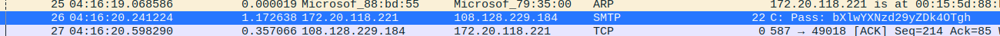
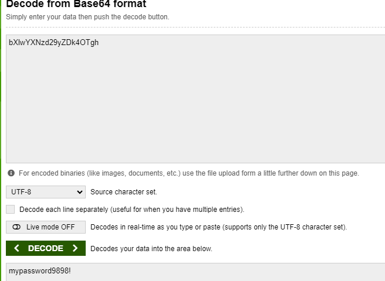
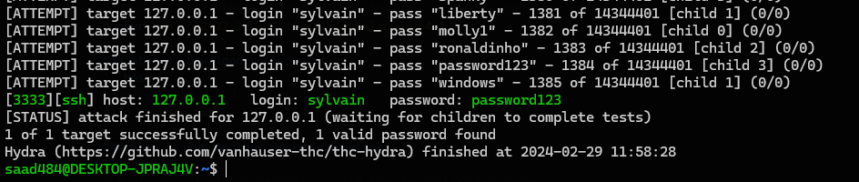

### Attack is the best defense

## ARP spoofing and sniffing unencrypted traffic

# Network Sniffing for Passwords - Security Project

## Introduction

Security is a crucial aspect of any system, and network security plays a significant role. Unencrypted traffic poses a potential risk as it can be intercepted and analyzed by malicious entities. This project focuses on sniffing unencrypted traffic to gather information, emphasizing the importance of securing communication channels.

In this specific scenario, the project involves sniffing telnet traffic to extract sensitive information. The target is an email service, Sendgrid, which offers both secure and unsecured communication methods. The provided script, `user_authenticating_into_server`, replicates the telnet authentication process to demonstrate the vulnerability.

## Project Steps

1. **Telnet Authentication:**
   Execute the provided script `user_authenticating_into_server` locally on your Linux machine, preferably Ubuntu.

2. **Sniffing with Tcpdump:**
   Use the `tcpdump` tool to capture network traffic during the telnet authentication process.

3. **Find the Password:**
   Analyze the captured network traffic to identify the password used in the telnet authentication.

## Execution Instructions

- Ensure you run the script on a Linux machine, such as an Ubuntu vagrant machine. The script may not work on Docker containers or Mac OS.

- Download the script [user_authenticating_into_server](link_to_script) from the repository.

- Execute the script:
  ```bash
  bash user_authenticating_into_server

## Analyze the captured data to find the password used in the telnet authentication with wireshark


- Let's decode the base64


## Dictionary attack

# Security Testing Setup README

This README provides instructions for setting up Docker and Hydra for security testing purposes. Please ensure that you use these tools responsibly and ethically, adhering to applicable laws and regulations.

### Step 1: Install Docker

```bash
sudo apt install docker.io
```
### Step 2: Install Hydra

```bash
sudo  apt install hydra
```
### Step 3: Run Docker Container
```bash
# Replace 'sylvainkalache/264-1' with the desired Docker image
docker run -p 2222:22 -d -ti sylvainkalache/264–1
```
### Step 4: Download rockyou.txt
```bash
# Navigate to the directory containing 'rockyou.txt'
gzip rockyou.txt
```
### Step 5: Run Another Docker Container
```bash
# Replace 'sylvainkalache/264-1' with the desired Docker image
sudo docker run -p 3333:22 -d -ti sylvainkalache/264-1
```
### Step 6: Use Hydra for Brute-Force Attack
```bash
# Replace 'rockyou.txt' with the appropriate wordlist
# Replace 'sylvain' with the target username
# Replace '127.0.0.1:3333' with the target SSH server address and port
# Adjust the '-t' option for the desired number of parallel threads
sudo hydra -l sylvain -P rockyou.txt ssh://127.0.0.1:3333 -t 4
```



## Note: Ensure ethical and legal use of security testing tools. Unauthorized access attempts are illegal and may have severe consequences.


